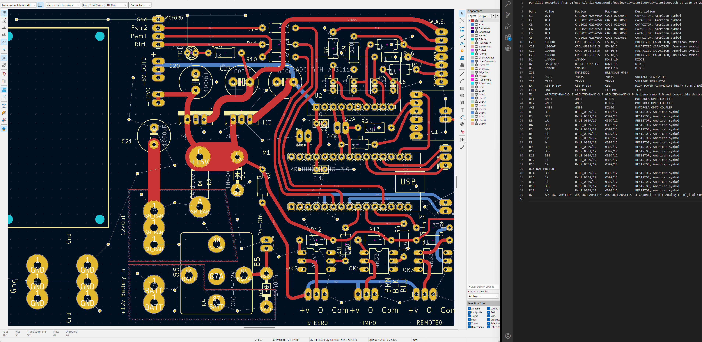
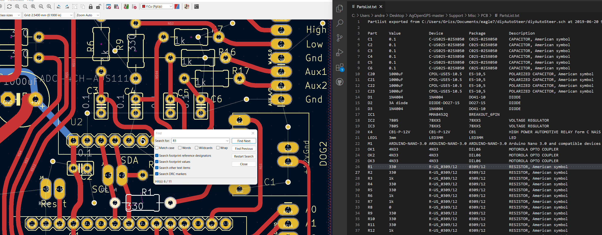
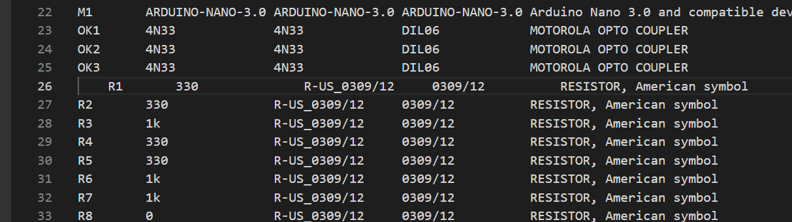

# Building an AOG PCBv2

So, to make life easy, open kicad and the partslist.txt files so you have them handy:

Get your board set up in a jig.

Build your board in the order of lowest -> tallest components. We'll start with the 330k resistors

In Kicad, press CTRL+F and enter "R1". You'll likely start at R10 or something, but just keep searching until you end up in the right place (highlighted in white).

Place your resistor (330k in this instance, see the text file) in R1 and solder in place. In your text file, press TAB at the beginning of the line to indent it, so you know you've done that part.

Work your way through the 330k resistors. When you're done, 9 indents, 9 330k resistors !

Then, start the 1k resistors. When you

Diodes next, then LED (long leg to R19)

Then, do the headers - here, I fitted an arduino ethernet shield, so I could be sure the headers were aligned correctly.

