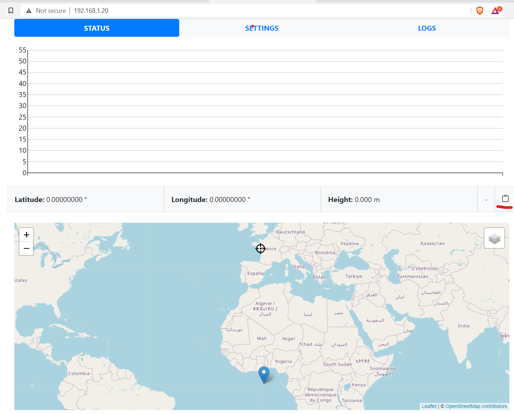
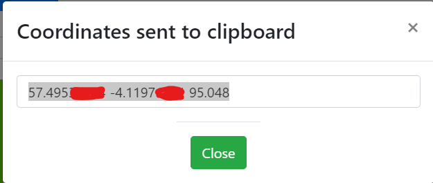
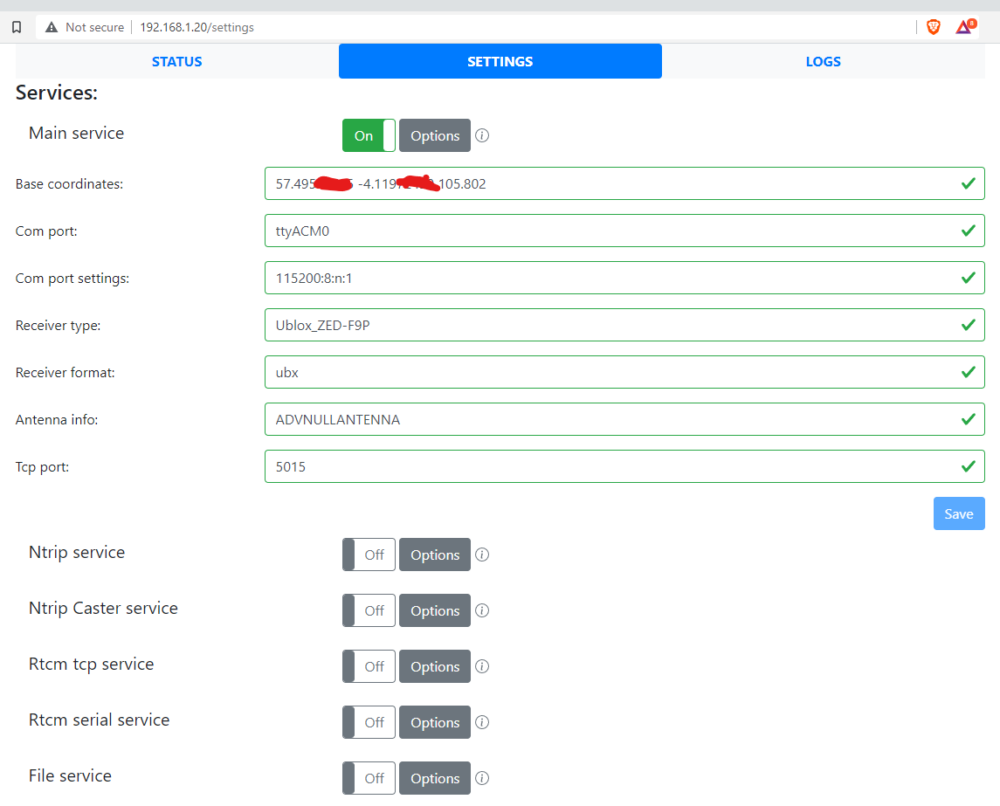
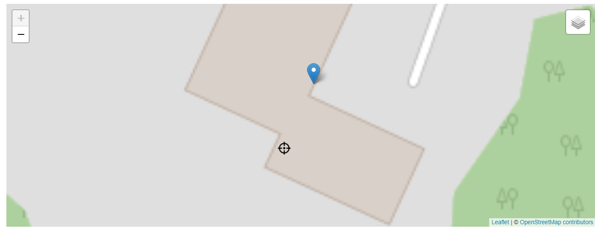

# Configuring your location

It's all plain sailing from here. No more screens full of text, just a couple of buttons and you're done!

So, on the previous page, you saw my RPI had picked an IP address of 192.168.1.20. Without a doubt, yours almost certainly will be different. So ensure you enter YOUR ip address into your browser, and you should see something like this and **this is not the password you set when you configured your Raspberry pi on first boot!!!**.

Here, the default password is "admin", so stick that in.

And hey presto - you're into rtkbase !

Not very useful tho, is it.... but pay attention to that little clipboard icon with the red underline.

In a moment or two - as long as your antenna has a clear view of the sky, you'll see something like this!

So, what's happening here? The blue marker is the location, roughly, of your antenna. The crosshair is the hard-location, where rtkbase has been told the base is. Chances are tho, that's not entirely accurate and it needs to be moved to where your base is.

With a clear view of the sky tho, quickly that blue marker will start moving closer to where you really are in the world, but the crosshair is still effectively not-near-you. At this stage, click the little clipboard icon to copy an approximate base location to the clipboard.

Now, go to the Settings tab at the top - this is where all the good stuff happens - and in the "base coordinates" box, paste the numbers you just copied. Then click the blue Save button. No need to change anything else in the "Main Service" section.

Now return to the Status page, and look - things look better already !

Notice tho that the crosshairs are still probably a bit approximate, and the blue marker is wandering about. This is the reading it's getting from the satellites, and the crosshair is where you've told it the base is.

Now, if you're using this RTK for actual surveying, then that's a big deal ! You need to have the crosshairs in exactly the right place as maps kinda rely on that sort of thing. But for differential GPS - RTK - you can be approximate enough.

What I tend to do however is let that web page with the bars sit for an hour or so, and then copy a new set of co-ordinates over. This gets you to a pretty good baseline.

We'll also see how we can get a log file uploaded and post-processed to get a more accurate base location, but that's in another section.

(to be continued when the antenna is outside!)