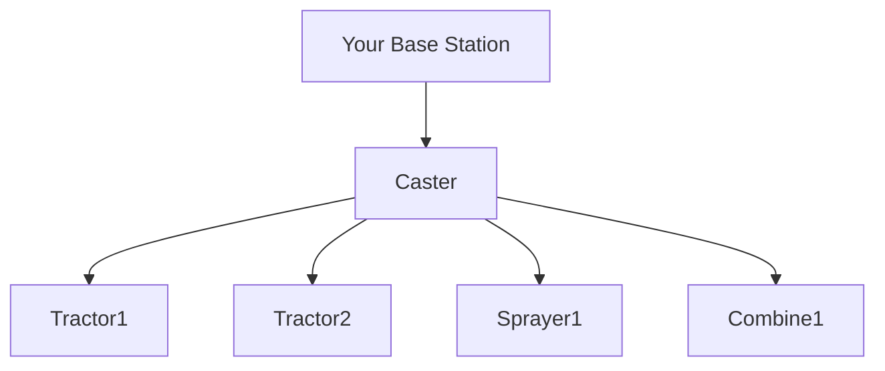

# FreeRTK

# First of all, this is information is now pretty old - go check out this more up-to-date video here!

https://youtu.be/fdhNE5D1g9w - part 1

https://youtu.be/vgqqXpgIloQ - part 2

---

# No seriously, go check out the videos instead!!

https://youtu.be/fdhNE5D1g9w - part 1

https://youtu.be/vgqqXpgIloQ - part 2

---

## How to set up your own RTK base station (if you don't want to watch the videos above)

OK, about time I got writing this stuff down. This is from the point of view of someone who wishes to set up their own base station. It's a lot simpler than you might think, if you can get past the hurdle of finding the little computers in stock that is...

---
## But, before we go any further - what this is, and what this IS NOT

### This is documenting how to set up an rtkbase station, and provide free RTK correction data to yourself and the local community. Nothing more! It is absolutely NOT a way to get free unlocks for centimetre level accuracy for your machinery. It's not a way to save you thousands in doing that. It's a way to potentially save you hundreds, per machine, per year for the RTK subscription tho. Also, you might well need to provide your own SIM card if that's how your system works. You can get data-only SIMs with 2gb allowance for a fiver a month, and some systems like FJ Dynamics, can use your phone as a hotspot, so you won't even need a SIM card.

If you do need a SIM card tho, I'd recommend https://v12.co.uk if you're in the UK. They do a range of 4-network un-steered SIM cards which will automatically roam to the network with the strongest 4G signal. So if on one half of your farm, O2 is strongest, yet when you're down the road it's all EE, then this will have you covered. Tell them FreeRTK sent you!

---

### Still here? Good, but before you think about buying a base station kit tho, you need to consider:
- is it really necessary? Is there more than enough coverage in my area?
- if I'm buying it primarily to support my vehicle, do I know for a fact it will work with it?
  - at time of writing, this works with Case IH Trimble, MF, New Holland RavenPrecision, Fendt, Claas S-terminals FJ Dynamics, AgOpenGPS and (with a different [message set](messagesets.md)), John Deere. John Deere are a bit of a nightmare tho, they don't make life easy. Consider yourself warned there...

So, onto the steps then !

- [What you need to buy](WhatToBuy.md)
- [Updating the firmware](UpdatingFirmware.md)
- [How to configure the raspberry pi](PiConfiguration.md)
- [Configuring your location](ConfigLocation.md)

So how does your signal get out to the machine in the field?

Well, that's via what's called a broadcaster (or caster for short). You make the programme - the correction signals - and you push them to the caster. The machines connect to the caster. So whether you've one machine or 100 connecting to your base, your internet usage is the same. You're only sending it once.

## Casters

The two main casters are rtk2go and centipede. rtk2go are the makers of popular NTRIP caster, SNIP - a powerful piece of software. They generously provide a free NTRIP service called rtk2go, and if you want to use that, you can do so. Centipede is ran by the French govt, for the benefit of French farmers (did you know they provide RTK free to everyone over there??) but anyone can use it. Both are great options and the good news is that rtkbase can push to both of them at the same time !

So go through the process and get yourself sorted for both:

- [Registering an rtk2go mount point](rtk2go.md)
- [Publishing to rtk2go](publishing.md)

and

- [publishing to Centipede](centipede.md)

Once that's done, you're finished setting up rtkbase.. but if you want more?

- [Dynamic DNS - get a hostname that follows your IP when it changes!](dns.md)
- [wait, message sets???](messagesets.md)
- [Checking your stream with SNIP](snip.md)
- [connecting your tractor](tractor.md)

Also, I'm not responsible for any mistakes or shortcomings in this guide, or any misadventure that might occur. Everything is at your own risk. Ya get it?

If you want to see it in action, here's a handful of videos using my base as a correction source:
- [FJ Dynamics](https://youtu.be/cLvjmOE0-rY)
- [Case Trimble](https://youtu.be/D7sSRx7XJ1Y)
- [NH T7 AutoCommand](https://youtu.be/C6NiiC102wA)
- [Fendt 724 Gen6](https://youtu.be/Ld9XlGIocTU)
- [Case CVX195 with AgOpenGPS](https://youtu.be/vvtz_aw-2HE) (note, we were still playing with steering settings at this point)
