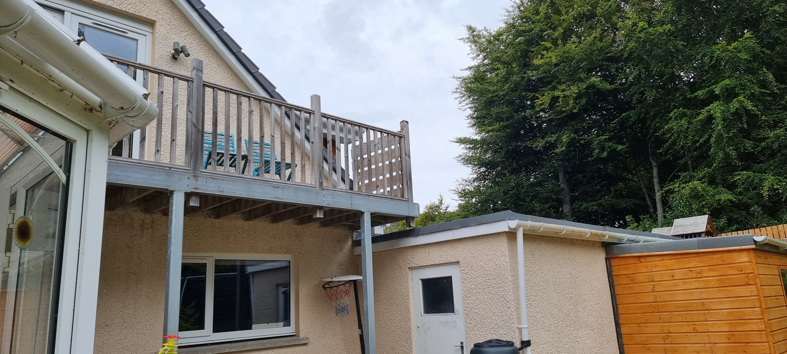
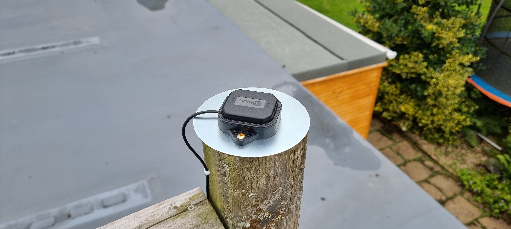

# Siting the antenna

Not much to say on this one - you want to have your antenna as high up and steady as possible (no poles that sway in the wind!) and with as clear a view of the sky in as many directions as you can.

The more it can see, the better the accuracy will be.

In my case, I've a lot of trees round about, and I also didn't want to put it above my roofline, so I tried it on a post on the balcony. Turned out it's fine and I get enough signal there to make it usable. Note that the F9P uses about 5 constellations, as opposed to a lot of base stations 2, so it can generally see more satellites anyway.

Hard to see, but it's on that fencepost on the right.

Also, you want a metallic background to the antenna, as performance will drop without one. Doesn't have to be huge, some kits will include a disc with it.

And that's pretty much that. Simple, huh!