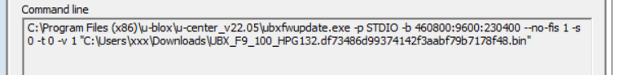

# Updating the firmware

Chances are your ZED-F9P doesn't have the latest firmware loaded. Well, let's fix that. Firmware updates tend to bring features, performance and security benefits.

First off tho - MAKE SURE your USB is connected to the USB port on the same end as the antenna. That XBEE port is not of interest here.

The makers, ArduSimple, have a [guide here](https://www.ardusimple.com/zed-f9p-firmware-update-with-simplertk2b/) and you should follow that.

One thing tho - if when you press the green Go button, it fails saying that it failed prematurely (can't remember the exact wording), then (and I wish I'd documented this previously, my bad...)

- open up a command prompt
- copy and paste the code that you see in your gray box into it and press RETURN
- 
- it will tell you the DLL that was missing
- find that in your windows\system32\drivers folder, and copy it to "c:\program files(x86)\u-blox\u-center_v22.05"

Am about 90% sure that was what I needed to do, but your mileage may vary. Doing the above won't hurt, anyway.

Again, if you're stuck with that error, please message us on https://fb.me/freertk