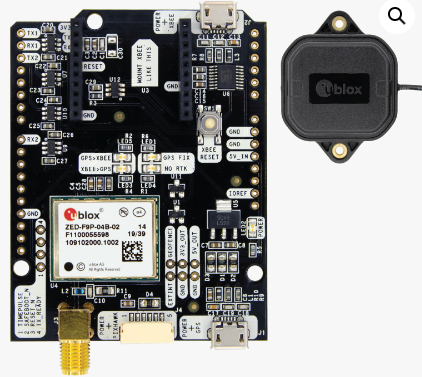
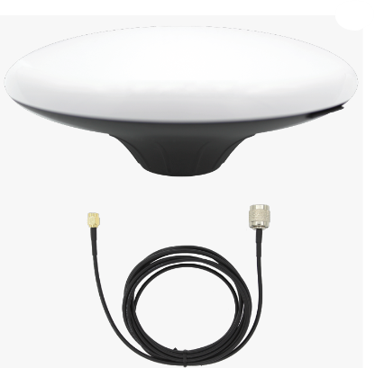
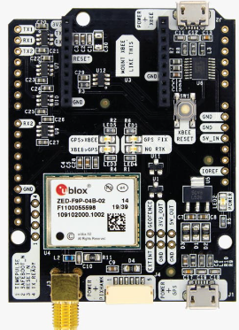

# What to buy

## The hardware

### The GPS

---
First, you're going to need a little computer to run rtkbase, the software that provides an easy to use interface to publishing your own RTK base station.

Some people choose to do this via their PC, but I don't recommend that, because having your PC running all the time is costly. Also, when you factor in the many vagaries of ublox u-center and SNIP, it can get pretty complicated pretty quickly. rtkbase is a custom operating system that delivers RTK and nothing more. Having a Raspberry pi running costs next to nothing, but even a low-spec PC uses typically over 100W of electricity, and in this day and age, that ain't funny.

So, first of all, you'll want to buy a GPS to use as a base station. This whole thing has come about in thanks to u-blox and their ZED-F9P chips. These are incredibly low-cost, but high-performance devices, and if you hit your favourite search engine, you'll easily find out why they're the preferred kit of choice for anyone providing RTK services.

I found the easiest to get them was here at Ardusimple, this is a starter kit of the board and the antenna:
https://www.ardusimple.com/product/simplertk2b-basic-starter-kit-ip65/

 

That's the one I've bought for a couple of base stations and it works great, and yep, if you've clear skies, that antenna will likely be more than enough to get you going.

If however, you'd like a fancier antenna (and again, it's not totally necessary), then you can buy [the board](https://www.ardusimple.com/product/simplertk2b/) on its own and [this antenna ](https://www.ardusimple.com/product/survey-gnss-multiband-antenna/) instead.

When you order from Ardusimple, you'll be given the opportunity to pay the import tax, or not - I opted not, and immediately got an email from DHL asking for the cash. So up to you really, think it works out about the same. In total, I paid about £250 tho.

Take note: if you're thinking about going for different models, then you REALLY want the ZED-F9P, and make sure you're not buying just the chip somehow. You really want that board with the micro USB output.

---

### The computer

This is the little computer that runs rtkbase - but thanks to the global semiconductor shortages, it can be tricky to find one.

What you want is a model 3 (A or B) or model 4. Avoid anything like Pico or Pi zero - and if in doubt, just shoot us a message on the [Facebook](https://fb.me/freertk) group.

While you're buying, you should add
- a case for it
- a memory card of at least 8gb
- a micro USB power supply
- You might also need a USB "Micro SD card reader". You can find these on Amazon if stuck for a fiver. Lots of laptops have these built in tho, so have a look

Some other things you'll need to complete the setup are:
- a USB keyboard
- a TV or monitor with HDMI connection
- a network/ethernet cable (optional, if not using wifi)

Reckon on around £50, for all this. Watch out for Rasperry pi models on Amazon that are the same, but stupid money. Patience and persistence will get you there without paying through the nose.

Some places to check out:
- https://www.okdo.com/c/pi-shop/pi-kits/
- https://thepihut.com/collections/raspberry-pi-kits-and-bundles

Once you've got that, you really do have all the hardware you need. So return to the previous page and find out what to check out next.
