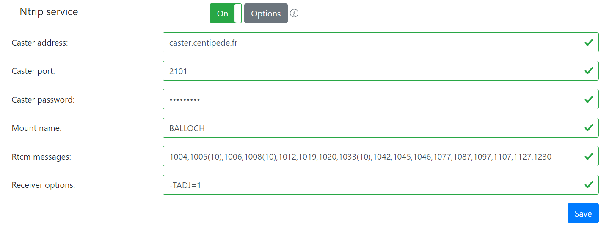

# Publishing to Centipede

So, at this point, your rtkbase software is up and running, you now have your base set, and everything is good, yes?

Not quite... now you have to push your corrections to Centipede, so other people can get them. Did you know, incidentally, that the VAST majority of RTK base stations at http://caster.centipede.fr:2101/ are u-blox F9P? Click the link and see for yourself.

Out of the box, rtkbase knows all about centipede - so at this point, just fill in your mount point name, ensure the password is "centipede" and press the "On" button!

Unfortunately, unless you properly register a mount point (and unlike rtk2go, it's not mandatory), your mount point won't appear in the caster table. But you can still use it if you know its name.

Back on rtk2base, you should now have green lights beside "Main service", "Ntrip service", and "File Service". And that's about it. Seriously. Go get some work done in the field, your work is over here! ;)

**Centipede shows a load of different configurations for John Deere, Fendt, CaseNH etc [here](https://docs.centipede.fr/docs/proprietaire/tracteurs.html)**

Yes it's in French, use [Google Translate](https://docs-centipede-fr.translate.goog/docs/proprietaire/tracteurs.html?_x_tr_sl=auto&_x_tr_tl=en&_x_tr_hl=en-US&_x_tr_pto=wapp) if you're stuck!

**Note that centipede is using a username and password of centipede.**