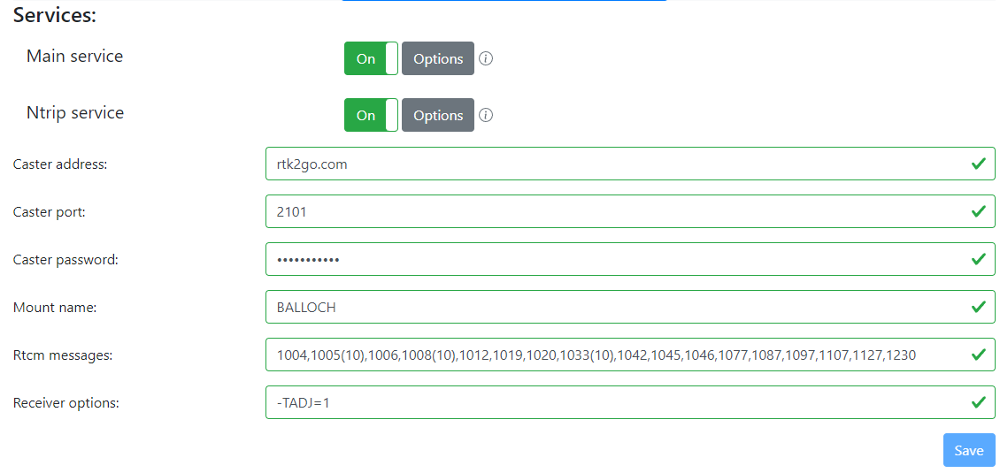

# Message sets

Ah.. message sets. Yeah, they're not fun.

When we set up our rtk2go connection, we did little other than put in the caster address, password and mount point name.

That section, RTCM messages, you likely left well alone.

For reference, and in case you ever lose them, this is them:

`1004,1005(10),1006,1008(10),1012,1019,1020,1033(10),1042,1045,1046,1077,1087,1097,1107,1127,1230`

However, we found in testing that older John Deere kit was not happy with that set, and in fact, it wanted this:

`1004,1006,1008,1012,1013,1019,1020,1033,1045,1046,1230`

Now, this presents us with a problem - we can only send one set to rtk2go, for one mount point. However, the author of rtkbase has extended the code base so that we can set multiple message sets up, but this isn't in full release as yet.

In time, we can simply reserve two mount points, eg "BALLOCH" and "BALLOCHALT", and publish the default list to BALLOCH, and the shorter list to BALLOCHALT.

I'd recommend we stick with the MOUNTPOINT / MOUNTPOINTALT naming scheme to make life easier for folks who are using this.