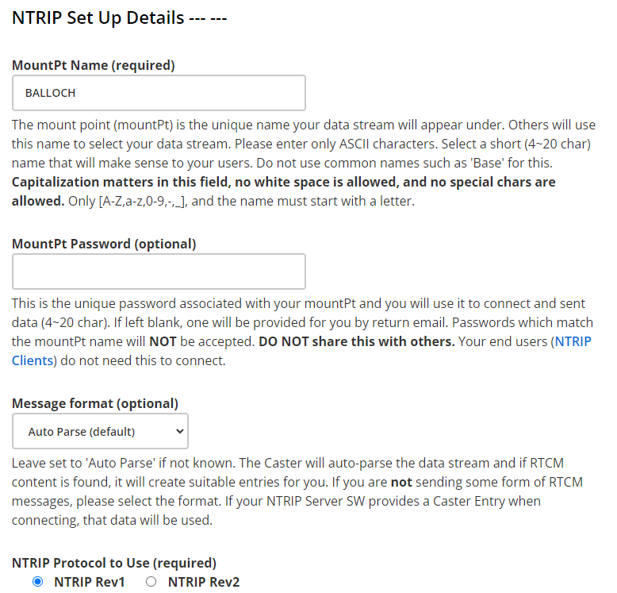
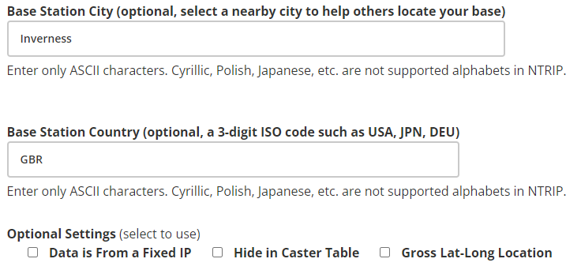
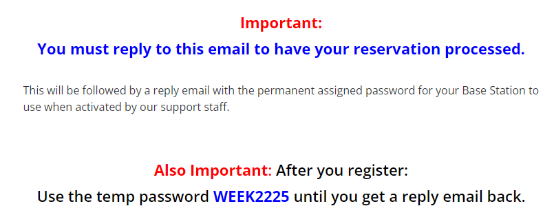

# Registering an rtk2go mount point

[rtk2go](http://rtk2go.com) is a free RTK "caster", which means its job to take the RTK corrections your base sends, and distribute them to rovers (tractors, combines etc). This way, your internet usage is minimal.

But we need to make a reservation for your location - your "mount point" - so do that [here](http://rtk2go.com/sample-page/new-reservation/).

Fill in the contact details, and I do suggest receiving the summary report (even tho I've never had one yet).

Pick a decent MountPt name. As the text suggests, don't go for "test" or "myublox" or "home" etc, but perhaps something relevant to the location you're in, the name of a local village or town, farm name etc.

You also want to pick a password, and if you don't, you'll be sent one to use instead. This is purely so nobody else can start sending corrections pretending to be your mount point.

Leave everything else at default, but put in a city and country.

 ### Do NOT tick the box about publishing from a FIXED IP!

Notice this bit at the bottom - you'll be sent a confirmation email which you have to reply to (don't have to say anything in it, just hit reply and Send) and then the reservation will be processed. You can use a temporary password until the point has become properly registered, and if you don't change it over at that point, then your site WILL be banned for a few hours until you resolve the issue.

With this in mind, I don't recommend enabling even on the temporary password UNTIL you have received confirmation that your mount point has been registered and should be using your proper password. Just be patient.

If you didn't get any emails, check your spam folder. Also, the mount point registration could take a few days and while you can use that WEEK2225 temporarily, if you don't change it once the reservation has happened, you might get banned for a bit. It's not permanent tho.

Also, if you're registering one as part of this document, please send the admins a message on [Facebook](https://fb.me/freertk) so they can update their map. Cheers!
