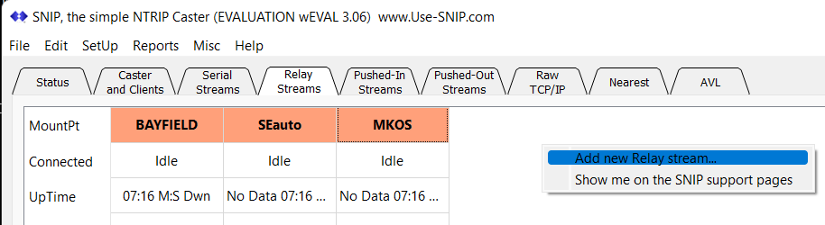
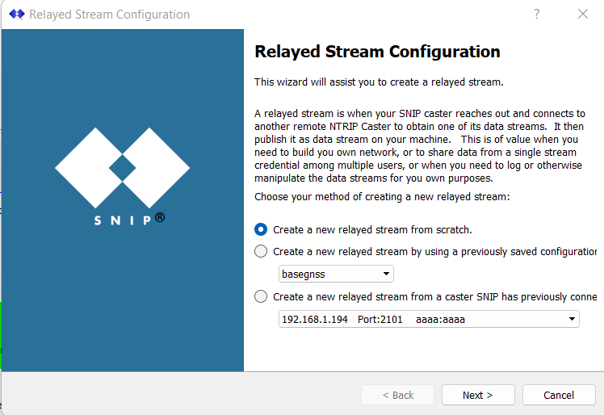
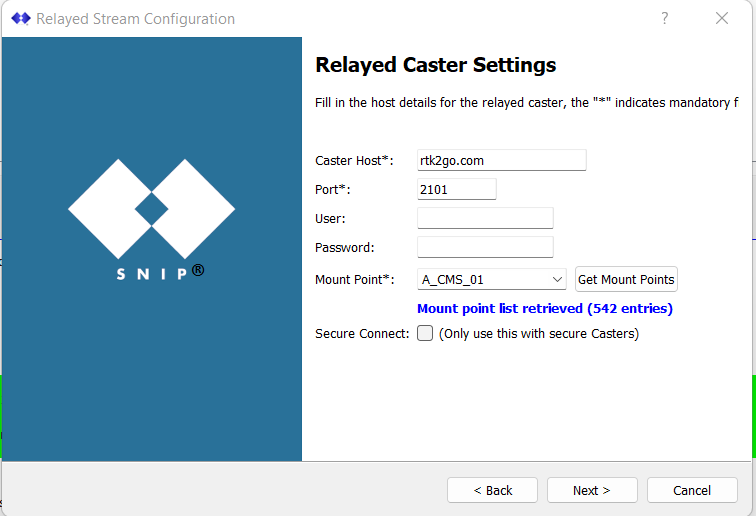
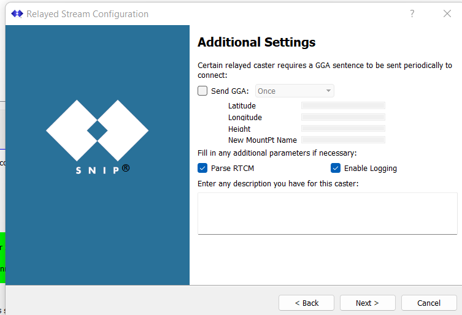
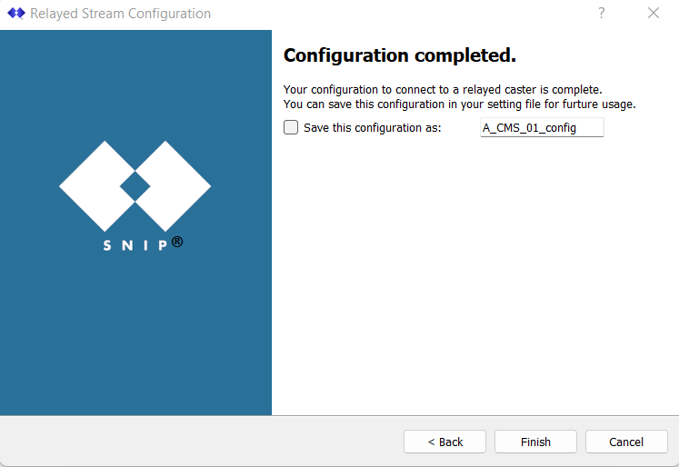
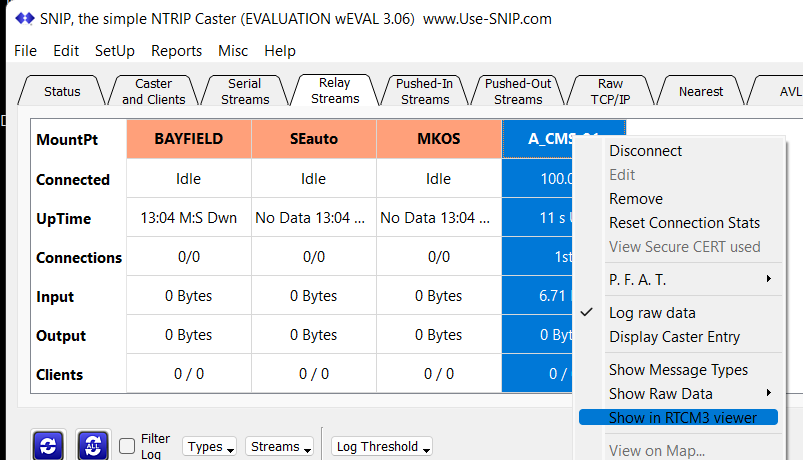

# Checking your message stream with SNIP

## So, you've published your stream - but how do you know it's working?

### Here's how to consume your own stream and take a look at the data.

First, you might want to set up a local caster in rtkbase (and that's on the "Ntrip caster service" section - by now, you'll know what to do there), but you can just as easily check out the data you're pushing to rtk2go.

Download SNIP here: https://www.use-snip.com/download/

Install, run, and then go to the Relay Streams tab, delete all the example ones (if you want), and then right-click to add a new stream.

Then, fill in the rtk2go details, creating a stream from scratch.

If you're adding your local IP address, it'll be the same IP as rtkbase (likely 192.168.1.something), or if not it could be rtk2go. Press "Get Mount Points" and pick your one off the list:

You don't really need to enter anything here, just Next through it.

and save the config

The stream will immediately connect, if it can, and start pulling down data. Right-click it and do "show in RTCM3 viewer".

And enjoy that sweet sweet free RTK ;)

**What else is this useful for? Well, if you pay for a commercial service, and you can't work out what message set your device needs, but the commercial one works fine, you can add the commercial as a relay stream and watch what messages they send. And then amend your "RTCM messages" in the "Nrtip service" section to match.**
