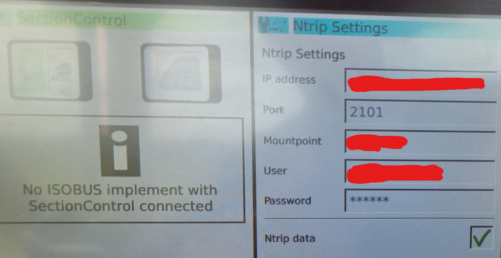

# Connecting your tractor

Every tractor is different I'm afraid.

But in short, you're looking for settings that mention:

- IP address or hostname (this will be 2.23.52.207 for rtk2go)
- port (this will be 2101)
- username (preferably uour email address)
- password (anything you like!)
- mount point (the mount point name you registered)

When you connect your tractor to rtk2go.com, they only ask that you provide a valid email address in case you're having issues and they want to contact you. I've never received an email from them for what it's worth. Password can be anything you like.

Uhfortunately, I don't have a lot of screenshots for this, but here's a couple:

On Fendt, you'll be into the guts of the GPS auto-steer menus. I had to blank out the info in this as it was the previous commercial supplier's details.

On FJ Dynamics, it's in the settings, (again, had to blank out the information). Here, you put in the IP for rtk2go.com and port, then press "Get Source", it will list all the mount points at rtk2go, pick yours and you're away. Fill in your email address for account, and again, password can be anything you like!

